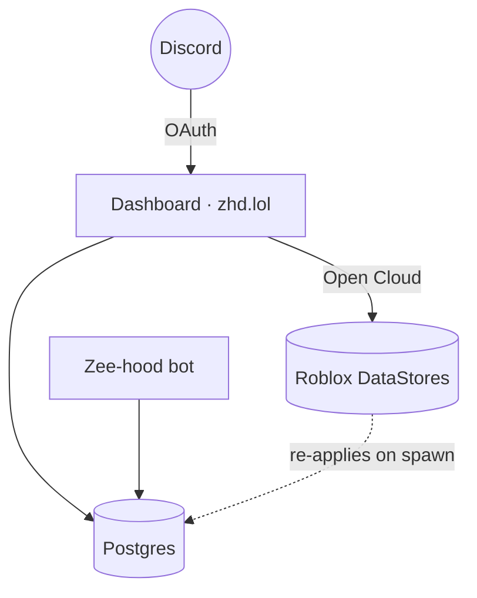

# How it works

A short tour of the stack. You don't need this to use the panel, but it helps to know where things
live.

## The parts

- ✨ __Dashboard (zhd.lol)__ — a Next.js app. Server-rendered pages; the grant engine and all writes run server-side.
- 📦 __Postgres__ — the single, **universe-independent** source of truth: perks, bans, whitelist, crew tags, per-server bot config, audit log.
- 🤖 __Zee-hood bot__ — the Discord.js bot. Shares the same database, so both sides see the same state.
- ⭐ __Roblox (Open Cloud)__ — grants are pushed into the game's DataStores + MessagingService so players get them live.
- 👥 __Discord__ — OAuth for staff login, plus the guilds, roles and channels the bot manages.

## Why it's laid out this way

The key idea is a **shared database**. Granting a perk on the panel writes the same row the bot reads
and the game loads — there's no message queue to fall behind and no "sync" step that can silently
fail. The grant lands in Postgres and the game together; if the in-game write fails, the whole grant
is rejected rather than half-applied. Because the DB is universe-independent, swapping games is just a
config change plus a one-click [DB→game sync](config.md#sync-database-game).

## How your session is kept safe

The panel is staff-only, so several guards run on every request:

| Guard | What it protects against |
| --- | --- |
| Discord OAuth + signed cookie | No passwords to leak; the session is signed server-side and can't be forged. Aged-but-valid cookies slide forward. |
| Live level checks on every route | The UI hiding a button isn't the security — access is resolved live (Discord roles + DB) and re-checked on the write itself. |
| CSRF origin check | Blocks another site from making state-changing requests with your cookie. |
| Per-IP write rate limit | Stops a flood of writes / brute-force attempts. |
| Strict nonce Content-Security-Policy | Only the app's own nonce-signed scripts can run — no injected code. |

!!! success

    The rule throughout: **the client is never trusted.** Every capability the UI shows is enforced
    again on the server, keyed to your resolved access.

## Why the panel feels fast

Pages are server-rendered, so you get real content on first paint. On top of that, the Server-tab
settings and the Whitelist / Bans lists use a small **stale-while-revalidate cache**: after the first
visit each page renders instantly from cache while a background refetch keeps it current.
