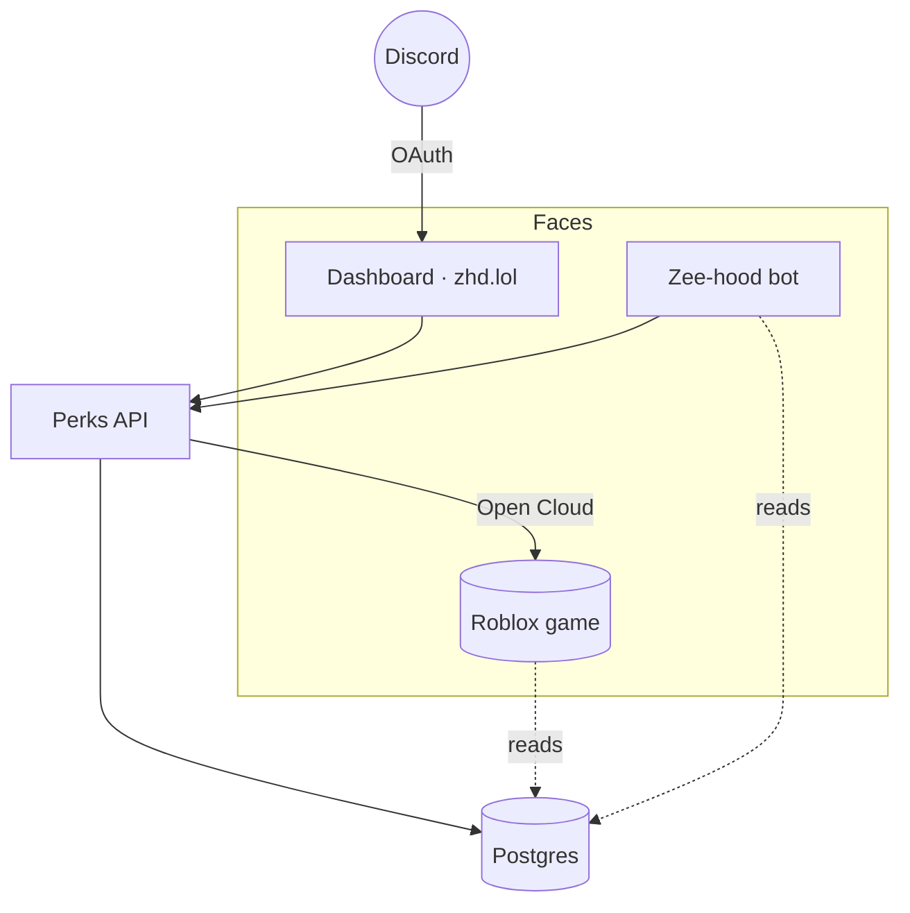

# How it works

A quick tour of the stack behind zhd.lol — the moving parts, how they talk to each other, and the
design choices that keep the panel fast and safe. You don't need this to use the panel, but it helps
to know where things live.

## The parts

- ✨ __Dashboard (zhd.lol)__ — a Next.js app, the panel you log into. Server-rendered pages, no data in the browser it shouldn't have.
- 🔑 __Perks API__ — owns the grant engine, auth, and the writes to Roblox. The dashboard and bot both call it.
- 🤖 __Zee-hood bot__ — the Discord.js bot. Shares the database with the panel so both see the same state.
- 📦 __Postgres__ — the single source of truth: grants, bans, whitelist, and per-server bot config.
- ⭐ __Roblox__ — grants are pushed into the game's DataStore over Open Cloud so players get them live.
- 👥 __Discord__ — OAuth for staff login, plus the guilds, roles and channels the bot manages.

*One database, many faces — the panel, the bot and the game all read and write the same records, so
nothing drifts out of sync.*

## Why it's laid out this way

The key idea is a **shared database**. When you grant a perk on the panel, you're writing the same
row the bot reads and the game loads. There's no message queue to fall behind and no "sync" step
that can silently fail — a change is visible everywhere the moment it's written. The grant lands in
Postgres and Roblox together; if the game write fails, the whole grant is rejected rather than
half-applied.

## How your session is kept safe

The panel is staff-only, so a few things run on every request:

| Guard | What it protects against |
| --- | --- |
| Discord OAuth + signed cookie | No passwords to leak; the session is signed server-side and can't be forged. |
| Level checks on every route | The UI hiding a button isn't the security — the API re-checks your level on the write itself. |
| CSRF origin check | Blocks another site from making state-changing requests with your cookie. |
| Per-IP write rate limit | Stops a flood of writes / brute-force attempts. |
| Strict Content-Security-Policy | Only the app's own, nonce-signed scripts can run — no injected code. |

!!! success

    The rule throughout: **the client is never trusted**. Every capability the UI shows is enforced
    again on the server, keyed to your whitelist level.

## Why the panel feels fast

Pages are server-rendered, so you get real content on first paint instead of a blank shell. On top
of that, the Server-tab settings and the Whitelist and Bans lists use a small **stale-while-
revalidate cache**: the first visit fetches, and every visit after that renders instantly from cache
while a background refetch keeps it current. That's why hopping between feature pages no longer shows
a loading flash.

## The other public pages

Not everything needs a login. A few pages are open to anyone:

| Page | Purpose |
| --- | --- |
| Front page | The public landing page with live community stats. |
| Catalog | Browse every grantable item in the game. |
| My perks | A player checks what they currently have. |
| Preview | See how a crew tag or emoji will render before it goes live. |
| Status | Live service status. |
| Docs | This documentation. |

!!! info

    That's the whole system. If something on the panel behaves unexpectedly, the audit log and the
    status page are the fastest places to start.
