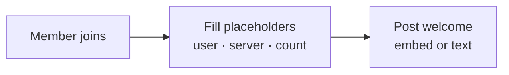
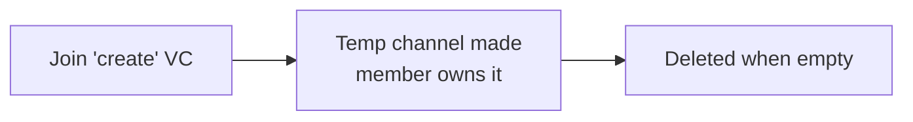

# Automation & roles

The rest of the bot's day-to-day features — self-assign roles, automatic responses, welcomes and
goodbyes, starboard, sticky messages, bump reminders and temporary voice channels. Each is a small,
self-contained automation you switch on per server.

## Roles members give themselves

Three ways to let members pick their own roles, no staff needed.

=== "Autorole"

    Automatic on join. Every new member gets the role(s) you choose.

    ```mermaid
    flowchart LR
        A[Member joins] --> B[Autorole<br/>assign configured roles]
    ```

=== "Reaction roles"

    React to toggle. Adding the reaction grants the role; removing it takes it back.

    ```mermaid
    flowchart LR
        A[React to a message<br/>chosen emoji] --> B[Role granted<br/>un-react removes it]
    ```

=== "Button roles"

    Click to toggle. A button panel members tap to add or remove a role.

    ```mermaid
    flowchart LR
        A[Click a button<br/>role panel] --> B[Role toggled<br/>add / remove]
    ```

## Automatic responses

=== "Autoresponder"

    When a message matches a trigger phrase, the bot posts your response.

    ```mermaid
    flowchart LR
        A[Trigger phrase seen] --> B[Auto-reply<br/>your configured message]
    ```

=== "Autoreact"

    Matching messages get reactions added automatically.

    ```mermaid
    flowchart LR
        A[Matching message] --> B[Auto-react<br/>adds emoji reactions]
    ```

## Welcome & goodbye

Greet new members and mark departures. Welcome messages support the placeholders `{user}`,
`{user.name}`, `{server}` and `{count}`, and can post as a branded embed or plain text.



!!! info

    Goodbye works the same way on leave. Both are configured on their own pages under the Server
    group.

## Channel helpers

=== "Starboard"

    Once a message hits the star threshold, it's reposted to the starboard — the community pins the
    best.

    ```mermaid
    flowchart LR
        A[Message gets stars<br/>from members] --> B[Threshold reached<br/>e.g. 5 stars]
        B --> C[Posted to starboard]
    ```

=== "Sticky message"

    The bot re-posts the sticky so it stays at the bottom as chat moves.

    ```mermaid
    flowchart LR
        A[New messages arrive] --> B[Sticky re-posted<br/>stays at the bottom]
    ```

=== "Bump reminder"

    After a bump, the bot waits out the cooldown and reminds the server.

    ```mermaid
    flowchart LR
        A[Someone bumps<br/>Disboard] --> B[Wait the cooldown<br/>~2 hours]
        B --> C[Reminder posted]
    ```

## VoiceMaster

VoiceMaster gives members their own temporary voice channels. Joining a designated "join to create"
channel spins up a private VC the member owns and can rename, lock or limit — and it's cleaned up
automatically when everyone leaves.



## Summary

| Feature | Trigger | Result |
| --- | --- | --- |
| Autorole | Member joins | Role(s) assigned automatically |
| Reaction roles | React / un-react | Role toggled |
| Button roles | Click a button | Role toggled |
| Autoresponder | Trigger phrase | Bot replies |
| Autoreact | Matching message | Reactions added |
| Welcome / Goodbye | Join / leave | Message or embed posted |
| Starboard | Star threshold reached | Message reposted to starboard |
| Sticky | New messages | Sticky kept at the bottom |
| Bump reminder | After a bump | Reminder once the cooldown ends |
| VoiceMaster | Join the create channel | Temp, member-owned VC |
