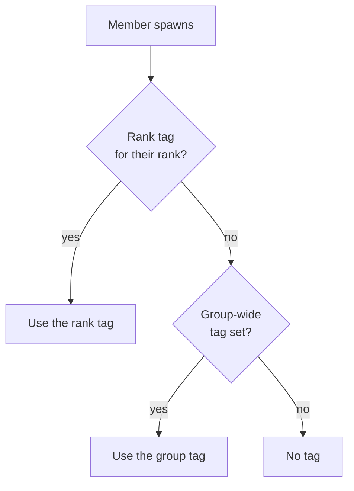
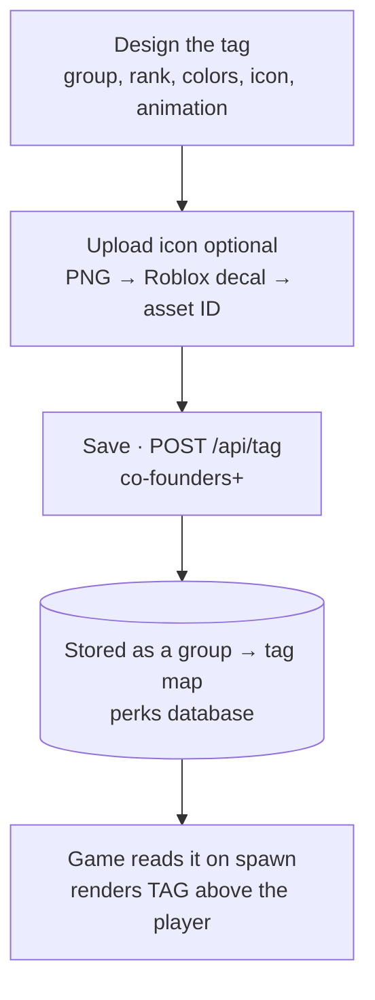

# Crew tags

A crew tag is the custom, colored name tag that renders above a player in-game — a bit of text
(emoji allowed), a color gradient, an optional icon, and an optional scrolling animation. Tags are
tied to a Roblox **group**, and can be set for the whole group or per rank.

## Anatomy of a tag

Every tag is made of four parts, all set on one form. Icon, text, gradient and animation are
independent — use any combination.

| Part | What it is | Notes |
| --- | --- | --- |
| **Tag text** | The label inside the brackets, e.g. 🍋 CREW. | Unicode emoji are allowed. |
| **Colors** | 1 to 8 colors blended into a gradient. | One color = solid; more = gradient. |
| **Icon** | A small image shown left of the text. | Paste a Roblox decal ID, or upload a PNG. |
| **Animation** | Scrolls the gradient across the text. | Direction + speed, or turn it off for a static tag. |

## Group-wide vs. per-rank

A tag is scoped to a Roblox group. You can define one **group-wide** tag that every member gets,
and then override it for specific **ranks**. The most specific tag wins: a rank tag always beats
the group tag for members of that rank.

*Leave the rank blank to set the whole group; fill it in to override just that rank.*

## How a tag reaches the game

Building a tag on the panel writes a group→tag mapping the game reads when a player spawns. If you
upload an icon, it's pushed to Roblox as a decal first and the returned asset ID is stored on the
tag. The icon upload is the only extra hop; text-only tags skip it.

## Building one, step by step

1. **Enter the group (and rank)** — put the Roblox group ID in. Leave the rank blank for the whole
   group, or set a rank number to target just that rank.
2. **Write the text and pick colors** — type the tag label (emoji welcome) and add 1–8 colors. The
   preview blends them into a gradient live.
3. **Add an icon (optional)** — paste a Roblox decal ID, or upload a PNG — the panel turns it into a
   decal and fills in the asset ID for you.
4. **Set the animation** — choose a scroll direction and speed, or switch animation off for a static
   tag.
5. **Save** — the tag is stored for that group/rank and applies in-game. Load any existing tag from
   the list to edit or delete it.

!!! warning

    Crew tags are gated at **co-founders (254)**. You can preview a tag design without saving on the
    panel's public **preview** page.
