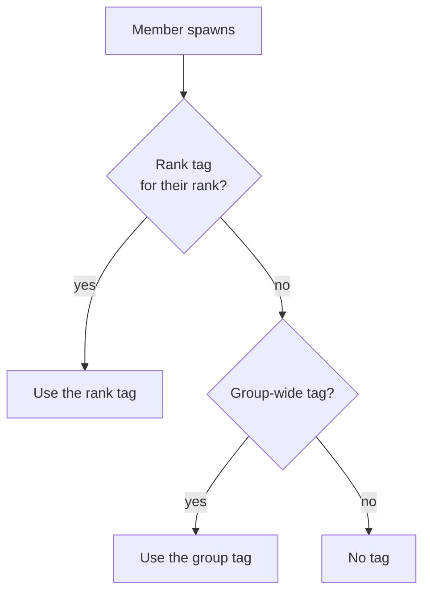

# Crew tags

A crew tag is the custom, coloured name tag that renders above a player in-game. It's tied to a
Roblox **group** and can be set group-wide or per rank. Gated at **co founders+ (254)**.

## The form

The **Crew Tags** page has a live preview beside a single form:

| Field | What it is |
| --- | --- |
| **Group ID** | The Roblox group the tag belongs to. |
| **Rank** | A rank number to target — leave **blank** for the whole group. |
| **Tag text** | The label shown in brackets, e.g. `CREW` (emoji allowed). |
| **Icon** | A Roblox decal/asset ID, **or upload a PNG/JPG** — it's pushed to Roblox and the returned asset ID is filled in for you (waits on Roblox moderation). |
| **Colors** | **1 to 8** hex colours blended top→bottom into a gradient. Use the colour picker or type hex. One colour = solid. |
| **Animated gradient** | Optional. Choose a **direction** (down / up / left / right / diagonal) and a **speed** (0.05×–4×). Off = static. |

The preview updates live as you type. **Save tag** stores it; **Clear / new** resets the form.

## Group-wide vs. per-rank

A tag is scoped to a group. Define one **group-wide** tag every member gets, then override it for
specific **ranks**. The most specific tag wins — a rank tag beats the group tag for members of that
rank.

## How it reaches the game

Saving writes a group→tag mapping the game reads when a player spawns. An uploaded icon becomes a
Roblox decal first; its asset ID is stored on the tag. Text-only tags skip that step.

## Managing tags

**Existing crew tags** lists every tag in the shared database with a coloured preview, group ID, rank
(or "group-wide"), direction and icon ID. Search by name / group / rank, **Edit** to load one back
into the form, or **Delete** it.
