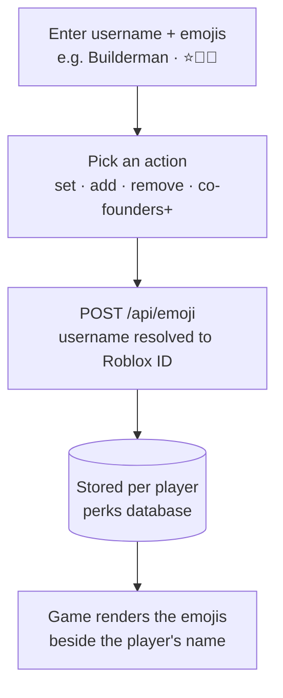

# Player emojis

Emojis are little badges pinned next to a player's name in-game. You assign one or more emoji to a
Roblox player from the panel, and they show up beside their name until you change them.

## Set, add, or remove

The Emojis page supports three actions so you can build a player's emoji set up or tear it down:

| Action | What it does |
| --- | --- |
| **Set** | Replaces the player's emojis with exactly what you typed. |
| **Add** | Appends the emojis you typed to whatever the player already has. |
| **Remove / clear** | Wipes the player's emojis entirely. |

## How it reaches the game

It's a short hop: the panel resolves the username to a Roblox ID, writes the emoji string to the
perks database keyed to that player, and the game reads it to render the badges by their name — the
same perks database the game already reads for grants.

## Assigning emojis, step by step

1. **Enter the player** — type the Roblox username. The panel resolves it to a Roblox ID.
2. **Paste the emojis** — drop in any unicode emoji — one or several.
3. **Choose the action** — **Set** to replace, **Add** to append, or **Clear** to remove all of
   them.
4. **Done** — the change is stored and shows in-game. The list below tracks every player who has
   emojis.

!!! warning

    Like crew tags, emojis are gated at **co-founders (254)**. Preview how emoji look on the panel's
    public **preview** page before assigning them.
