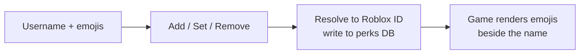

# Player emojis

Emojis are badges pinned next to a player's name in-game. Gated at **co founders+ (254)**.

## The form

The **Emojis** page takes a **Roblox username** and a string of **emojis** (paste any), with three
actions:

| Action | What it does |
| --- | --- |
| **Add to existing** | Appends the emojis to whatever the player already has. |
| **Set (replace all)** | Replaces their emojis with exactly what you typed. |
| **Remove all** | Clears the player's emojis. |

## How it reaches the game

The panel resolves the username to a Roblox ID, writes the emoji string to the shared perks database
keyed to that player, and the game reads it to render the badges by their name.

## Managing emojis

**Players with custom emojis** lists everyone in the emoji datastore with their current emoji.
Search by user ID or emoji, and **Remove** to clear a player.
