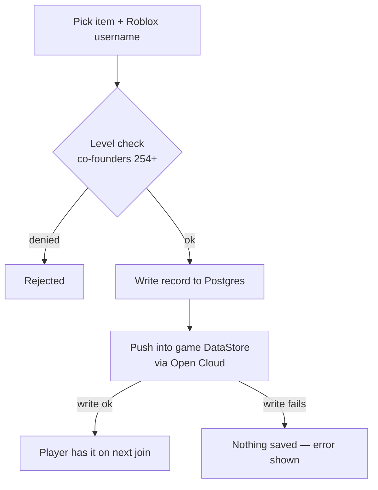

# Game control

The Game portal hands out everything a player can have in the Roblox game — abilities, stands,
vehicles, tools, passes, crew tags and emojis. Grants are looked up by Roblox username, can be
permanent or timed, and sync to the game automatically.

## What you can grant

- ⚡ __Powers__ — abilities a player can use in-game. Grant one, several, or an all-powers bundle.
- ⭐ __Stands__ — assign a stand to a player's account.
- 🚗 __Cars__ — vehicles like the SVJ, unlocked per player.
- 🔧 __Tools__ — in-game tools and utilities.
- 🎟️ __Gamepasses__ — grant passes without the player buying them.
- ⚡ __Shazam__ — the Shazam perk, granted on its own page.
- 🚩 __Start BR__ — permission to start a Battle Royale round.
- 🏷️ __Crew tags__ — custom name tags shown next to a player.
- 🙂 __Emojis__ — custom emojis tied to a player or crew.

## How a grant works

Every page in this portal shares the same flow. You pick an item, type a Roblox username, choose
permanent or a duration, and grant. The Perks API checks your level, writes the record to Postgres,
and pushes the change straight into the game's DataStore over Open&nbsp;Cloud — so the player has
it the next time they join (or immediately if they're already in).

!!! note

    If the in-game write fails on a grant, nothing is saved — you get an error instead of a
    half-applied perk.

**Step by step:**

1. **Pick the item** — choose the power / stand / car / pass from the list on the page.
2. **Enter the Roblox username** — the panel resolves it to a Roblox ID; a bad username fails fast
   instead of granting nothing.
3. **Permanent or timed** — leave it permanent, or set a duration (minutes → weeks) to make it a
   temporary grant.
4. **Grant** — the perk is written to the database and the game. Revoke on the same page takes it
   back.

## Temporary grants

Setting a duration turns a grant into a **temporary grant**. The panel records an expiry, and a
background sweeper automatically revokes it when the time is up — no need to remember to take it
back. The **Temp Grants** page lists everything currently ticking down with its remaining time,
newest first, with a live countdown and one-click revoke.

## Bundles & bulk grants

Two ways to move fast:

| Tool | What it does | Where |
| --- | --- | --- |
| **Bulk mode** | Paste a list of usernames and grant the same item to all of them at once. | Any grant page |
| **Bundles** | Group several items into one named bundle and grant the whole set in a single action. | Bundles |
| **Sweep** | Force-revoke expired temp grants immediately instead of waiting for the sweeper. | Temp Grants |

!!! warning

    Grants are gated at **co-founders (254)** and above. Lower ranks can view the pages but the
    Grant / Revoke buttons are disabled — the API rejects the write regardless of the UI.

## Crew tags & emojis

Crew tags are the custom, colored name tags that render above a player, and emojis are badges
pinned next to their name. Both live in the Game portal and both are gated at co-founders. They
each get a full walkthrough of their own:

- **[Crew tags](crew-tags.md)** — text, gradients, icons and animation, scoped per group or rank.
- **[Emojis](emojis.md)** — assign unicode emoji to a player with set / add / remove.

You can also preview either before it goes live on the panel's public **preview** page.

## Verification & redeem codes

Members link their Roblox account with `,verify <username>` (a one-time code in their Roblox
profile — no passwords). Once linked, the bot can sync their Discord roles from their group rank
automatically, and they can claim perk bundles: staff generate a code with
`,redeemcode create powers:Batman armor:50 uses:10` and players run `,redeem <code>` to receive
those perks in-game — one claim each, respecting the code's use limit and expiry.

## Editing the public game site

The public game site at [zeehood.org](https://zeehood.org) is editable from the dashboard under
**Site → Game Site** (super owners only). You can change the Roblox game link, the Discord invite,
the place ID (which drives the live player count and screenshots), and the game&nbsp;passes,
staff&nbsp;roles, shop&nbsp;items and powers lists — each as add/remove rows. Saved changes appear
on the live site within about a minute, and the site keeps its built-in values as a fallback so it
always renders even if the dashboard is unreachable. Full walkthrough: [Game Site
editor](game-site.md).
