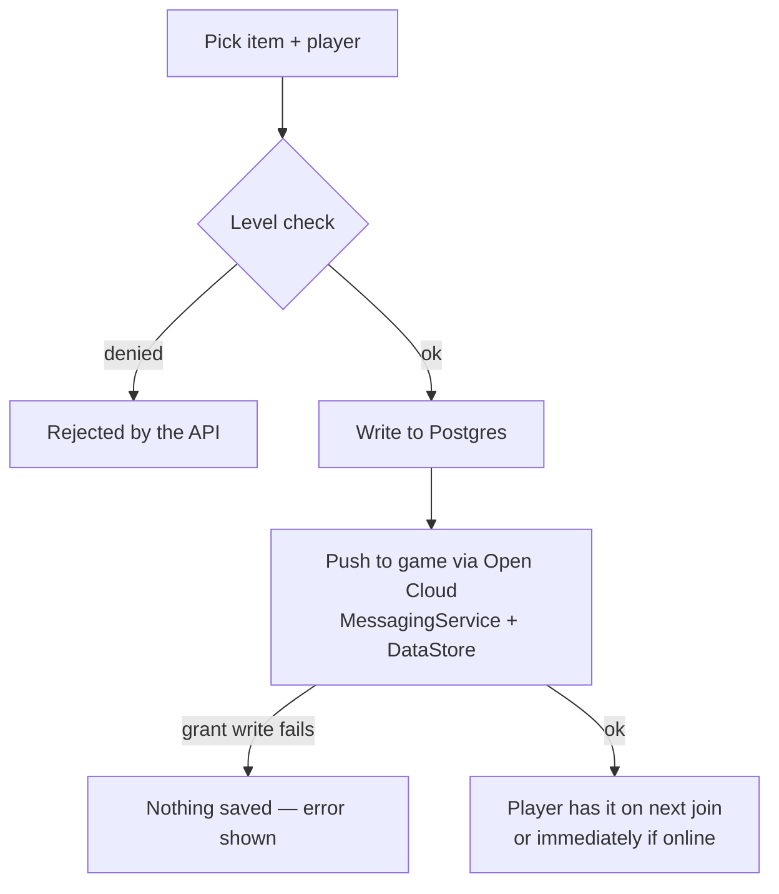

# Game control

The Game portal hands out everything a player can have in the Roblox game. There are **seven grant
pages** that all share one interface, plus **Bundles** and **Temp Grants** tools. Crew tags and
emojis are cosmetics with their own pages ([Crew tags](crew-tags.md) · [Emojis](emojis.md)).

## The grant pages

| Page | Grants | Level to grant |
| --- | --- | --- |
| **Powers** | Abilities (28, including ★ All Powers) | co owners 251+ |
| **Stands** | Soft & Wet, The World, Star Platinum, Wonder of U, D4C | co owners 251+ |
| **SVJ Car** | The SVJ vehicle | co owners 251+ |
| **Tools** | ~45 in-game tools & gadgets | co owners 251+ |
| **Gamepasses** | Katana, Armor, Mask, Aim Lock/Viewer, spawn items | **staff advisor 247+** |
| **Shazam** | 13 Shazam variants | co owners 251+ |
| **Start BR** | Permission to start a Battle Royale round | co owners 251+ |

The full item lists are on the **[Item catalog](catalog.md)** page.

## How a grant works

Every grant page works the same way. Each shows how many of that category are handed out
(*"3,120 given out · 214 players"*) and how many items are available.

1. **Pick an item** from the grid.
2. Choose **Single** or **Bulk** mode.
3. Enter a **Roblox username or ID** (single) or paste a list (bulk).
4. Set a **Duration** — Permanent, or a number + unit (seconds / minutes / hours / days / weeks).
5. **Grant** — or **Revoke** to take it back.

!!! note "Grants are all-or-nothing"

    On a **grant**, if the in-game write fails, nothing is saved — you get an error, never a
    half-applied perk. On a **revoke**, the database entry is always removed even if an in-game step
    hiccups (so the perk can't linger and re-apply), and the hiccup is surfaced as a warning.

### Under the hood

Different categories reach the game by different routes, but you don't have to think about it:

- **Powers** → `DiscordAdminPowerGrantV1` + a `DashboardGrant` publish + the `DashboardWhitelist`
  DataStore (so whitelist-gated powers like Flash/Fly/Magic persist across servers).
- **Gamepasses** → `DiscordAdminGrantV1`.
- **Shazam** → a `DashboardGrant` publish + the player's `PlayerPerks` DataStore (re-applies on spawn).
- **Stands / SVJ car / tools / Start&nbsp;BR** → a `DashboardGrant` publish the game reads on spawn.

Revoking a single power from an **All Powers** holder is handled specially — it expands them to
"every power except that one", so the revoke actually lands.

## Single vs. bulk

- **Single** — one player, with the duration picker.
- **Bulk** — paste usernames/IDs (one per line or comma-separated) and **Grant all** / **Revoke all**
  at once; you confirm the count first, and the result reports `done/total` with any failures.

## Currently granted

Co&nbsp;founders+ get a **Currently granted** list on each page: everyone in the shared database who
holds an item in that category, with who granted it. You can **Export CSV**, or **Remove** every item
a player has in that category in one click.

## Temp Grants

Setting any non-permanent duration makes it a **temporary grant**. The **Temp Grants** page lists
everything counting down, newest first, with a **live countdown**. A background sweeper auto-revokes
each one when its timer ends; the page refreshes itself every 20&nbsp;seconds so expired rows drop off.

For each grant you can **Revoke** now, or **extend** by **+1h / +1d / +1w** (extend adds to whatever
time is left, so it truly extends rather than resets).

## Bundles

The **Bundles** page (co&nbsp;founders+) groups several items across categories into one named set:

1. Name the bundle, pick a **category** and **item**, **Add item** (repeat).
2. **Save bundle**.
3. **Apply** it to a player by username/ID — every item is granted at once. Items the applier's rank
   can't grant are **skipped** (reported), not forced.

## Verification & redeem codes (member-side)

Members link their Roblox account in Discord with `,verify <username>` (a one-time code in their
Roblox profile — no passwords). Once linked, the bot can sync their Discord roles from their group
rank, and they can claim perk bundles: staff generate a code with
`,redeemcode create powers:Batman armor:50 uses:10` and players run `,redeem <code>` to receive those
perks in-game, respecting the code's use limit and expiry.
