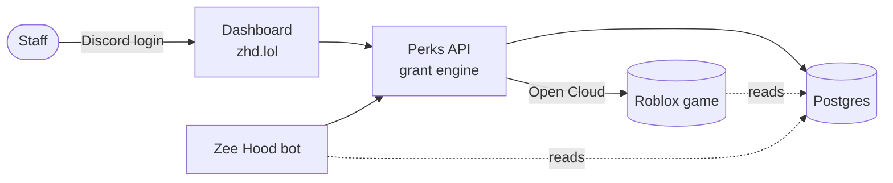
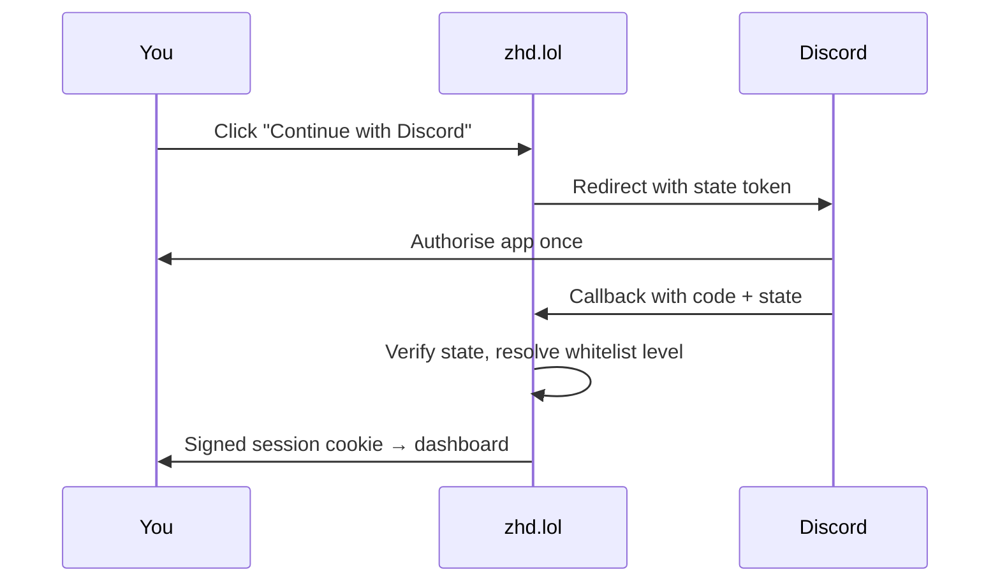

# The zhd.lol control panel

**zhd.lol** is the staff control panel for the Zee&nbsp;Hood community — one place to hand out
in-game perks, moderate players, and configure the Discord server and bot. This guide covers
every part of the panel, who can use it, and how the pieces fit together.

**2**portals — Game &amp; Server

**40+**feature pages

**1**Discord login

## What it does

The panel is split into two portals that share one login and one permission model. You switch
between them from the sidebar.

- ⚡ __Game control__

    ---

    Grant powers, stands, cars, tools, gamepasses, crew tags and emojis that show up in the
    Roblox game.

    [Game control →](game-control.md)

- 🚫 __Moderation__

    ---

    Ban, warn, kick and unban players; keep a blacklist; look up history; audit every staff
    action.

    [Moderation →](moderation.md)

- 🤖 __Server management__

    ---

    Configure the Discord bot — automod, welcome, levels, tickets, logging and 30+ more
    features.

    [Server management →](server-management.md)

- 🛡️ __Access control__

    ---

    A single rank ladder decides what each staff member can see and do, enforced on every
    request.

    [Access &amp; roles →](access.md)

## How the pieces fit together

Everything runs off one small stack. The dashboard talks to a Perks API, which owns the grant
engine and writes to Postgres and to the Roblox game over Open&nbsp;Cloud. The Discord bot shares
the same database, so a change you make on the panel is the same change the bot and the game see.

!!! info

    You never touch Roblox or Discord tokens directly. The panel and bot hold them server-side —
    staff only ever sign in with Discord.

## Signing in

There are no passwords. You log in with Discord, and your access level comes from the staff
whitelist. If you're not whitelisted, an owner has to add you first.

1. **Open zhd.lol** — you land on the public front page. Hit "Staff login" in the top-right, then
   "Continue with Discord".
2. **Approve on Discord** — Discord asks you to authorise the app once. Nothing is posted on your
   behalf.
3. **You're matched to a rank** — the panel looks you up on the staff whitelist and resolves your
   level. Everything you can do flows from that number.
4. **Land on your dashboard** — you get a signed session cookie and the two portals appear in the
   sidebar.

!!! warning

    Getting *"You're not whitelisted"*? That's expected until an owner adds your Discord ID on the
    [Whitelist](access.md) page. It isn't a bug.

## Where to go next

- 🔑 __Access &amp; roles__

    ---

    The rank ladder, super owners, and exactly what each level unlocks.

    [Read more →](access.md)

- ⚡ __Game control__

    ---

    Grant perks, bundles and temporary grants, and how they reach the game.

    [Read more →](game-control.md)

- 🚫 __Moderation__

    ---

    Bans, blacklist, purge, player lookups and the audit log.

    [Read more →](moderation.md)

- ⚙️ __Server management__

    ---

    Every Discord bot feature, page by page.

    [Read more →](server-management.md)

