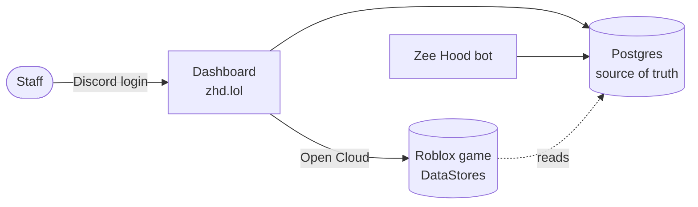

# The zhd.lol control panel

**zhd.lol** is the staff control panel for the Zee&nbsp;Hood community. One Discord login, two
portals: hand out everything a player can have in the Roblox game, and configure the Zee&nbsp;Hood
Discord bot for every server it's in.

**2**portals — Game &amp; Server

**9**grant categories

**35+**bot features

## The two portals

- 🎮 __Game portal__

    ---

    Grant powers, stands, cars, tools, gamepasses, Shazam, Start&nbsp;BR, crew tags and emojis; run
    the Roblox group; ban players; audit everything.

    [Game control →](game-control.md)

- 🤖 __Server portal__

    ---

    Configure the Discord bot per server — security, automation, levels, tickets, economy, logging
    and 35+ features in all.

    [Server management →](server-management.md)

Which portal(s) you see depends on your access: the Game portal follows the **rank ladder**, the
Server portal follows your **standing in each Discord server**. Many staff see only one. See
[Access & roles](access.md).

## How the pieces fit together

Everything runs off one shared **Postgres** database — the universe-independent source of truth. The
dashboard and the bot both read and write it, and grants are pushed into the Roblox game's
DataStores over **Open&nbsp;Cloud**. A change you make on the panel is the same change the bot and the
game see, with no sync step that can silently fall behind.

!!! info

    You never touch Roblox or Discord tokens directly. The panel and bot hold them server-side —
    staff only ever sign in with Discord, and every capability the UI shows is re-checked on the
    server.

## Signing in

There are no passwords. You log in with Discord; your access is resolved live from your Discord roles
(and the staff whitelist) on every request.

1. **Open zhd.lol** and choose **Staff login → Continue with Discord**.
2. **Authorise the app once.** Nothing is posted on your behalf.
3. You land on your **dashboard home** — a live overview with your rank, players in-game, active temp
   grants, recent staff activity and what's new.

!!! warning

    *"You're not whitelisted"* is expected until an owner adds your Discord ID (or you hold a mapped
    role). It isn't a bug — see [Access & roles](access.md).

## Where to go next

- 🔑 __Access & roles__ — the level ladder, super owners, and the three access systems. [Read →](access.md)
- ⚡ __Game control__ — grant perks, in bulk or on a timer. [Read →](game-control.md)
- 🚫 __Moderation__ — bans, lookups, blacklist, audit and the danger zone. [Read →](moderation.md)
- ⚙️ __Server management__ — every bot feature, page by page. [Read →](server-management.md)

