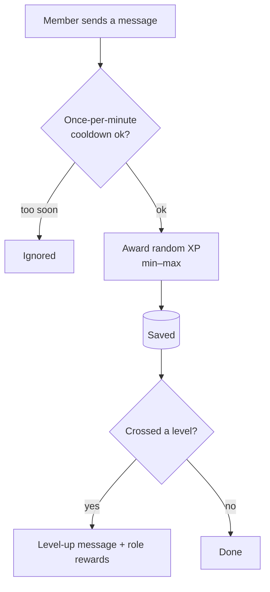

# Levels & XP

Members earn XP as they chat — rate-limited so spam doesn't pay — and levels can trigger a message
and role rewards. The **Levels** page (in the [Utility](utility.md) group) also shows the server's XP
leaderboard.

## How XP is earned

The bot grants a small, random amount of XP per message, but only **once per minute** per member. XP
accumulates server-side; crossing a level threshold fires the level-up flow.

## What you configure

| Field | What it controls |
| --- | --- |
| **Level-up channel** | Where the announcement posts (blank = the same channel they levelled in). |
| **Level-up message** | Text, e.g. `{user.mention} reached level {level.new_rank}!` (`{user.name}`, `{guild.name}` also work). |
| **Min / Max XP per message** | The random range awarded per eligible message. |
| **Role rewards** | Rows of **level → role** granted automatically at that level. |

Needs the Message Content intent; role rewards need *Manage Roles*. The leaderboard reads the same XP
table, so it updates as members chat — no separate tally.
