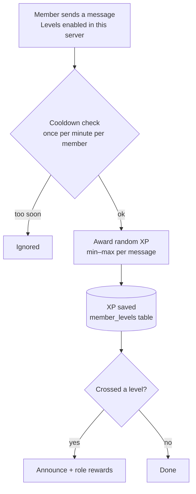

# Levels & XP

The Levels feature rewards members for chatting. Every message earns a little XP (rate-limited so
spam doesn't pay), XP rolls up into levels, and levels can trigger announcements and role rewards.
A public leaderboard ranks everyone.

## How XP is earned

The bot grants a small, random amount of XP per message, but only **once per minute** per member —
so hammering chat doesn't farm levels. XP accumulates server-side; when a member crosses a level
threshold, the bot fires the level-up flow. The 60-second cooldown is what keeps XP fair.

## What you can configure

| Setting | What it controls |
| --- | --- |
| **Enabled** | Master switch for the whole feature in this server. |
| **XP range** | The min–max XP granted per eligible message. |
| **Level-up message** | Custom announcement text, e.g. `{user.mention} reached level {level.new_rank}!` |
| **Role rewards** | Roles automatically granted when a member hits a level. |
| **Leaderboard** | The public XP ranking, shown on the Leaderboard page. |

!!! info

    The **Leaderboard** page reads the same XP table, so rankings update as members chat — no
    separate tally to maintain.
