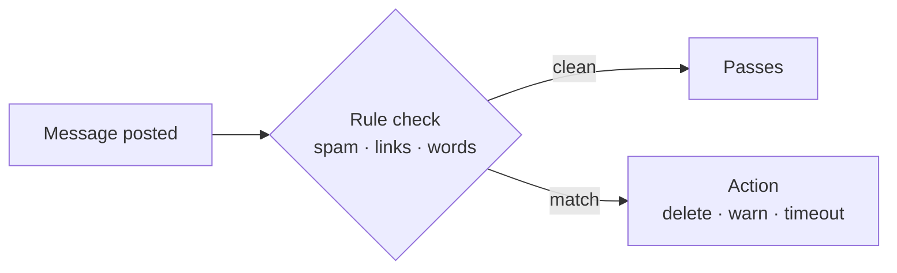
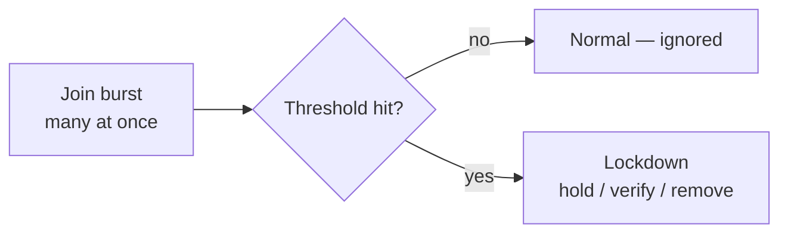
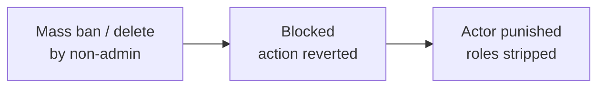
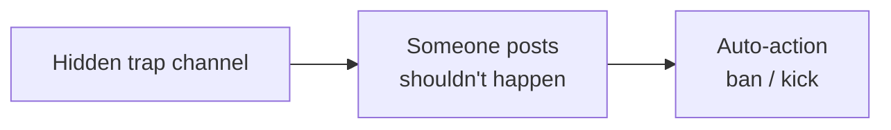
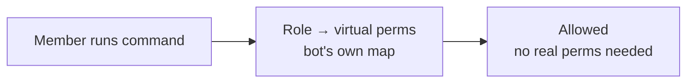

# Security features

The security suite protects a server automatically — filtering messages, stopping raids, blocking
nukes, and catching bad actors. Each one is a toggle-and-configure feature; here's how each actually
works.

!!! warning

    **Antinuke** and **Antiraid** are the most powerful settings, so they only appear for the server
    owner or its antinuke admins — never plain staff.

## Automod

Automod inspects every message against the rules you enable — spam, invite links, banned words, mass
mentions, and more — and takes the action you set when one matches. A clean message passes
untouched; a match is actioned instantly.

## Antiraid

Antiraid watches the *rate* of joins. When a burst looks coordinated — many accounts joining at
once, often brand-new — it locks the server down: new joins are held, verified, or removed until the
wave passes. Normal joins are ignored; a spike trips the lockdown.

## Antinuke

Antinuke guards against a compromised or rogue moderator doing catastrophic damage. Dangerous
actions — mass bans, mass channel/role deletes — by anyone who isn't a whitelisted admin are
blocked, and the actor is stripped and punished.

## Honeypot

A honeypot is a hidden trap channel that legitimate members never post in. Anyone (or any self-bot)
that does is flagged and auto-actioned — a cheap, reliable way to catch spammers.

## Fake Permissions

Fake permissions let you grant command access through a role *without* giving that role real Discord
permissions. The bot maps roles to virtual permissions and checks them itself, so you can hand out
bot powers without handing out Discord powers.

## Summary

| Feature | Trigger | Response |
| --- | --- | --- |
| Automod | A message matching a rule | Delete / warn / timeout |
| Antiraid | A burst of joins | Lockdown / verify / remove |
| Antinuke | Mass destructive action by a non-admin | Block + strip the actor |
| Honeypot | A post in the trap channel | Auto ban / kick |
| Fake Permissions | A command run by a mapped role | Allow without real Discord perms |
