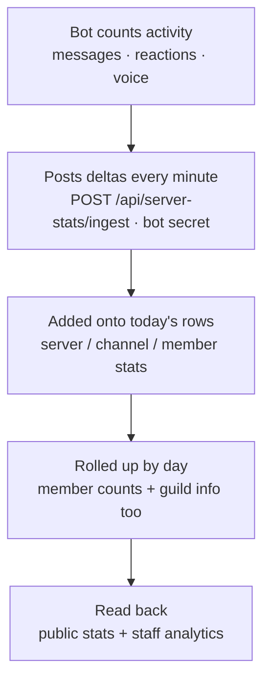

# Stats pipeline

The numbers on the front page and the Analytics page come from the same place: the bot reports
activity every minute, the dashboard rolls it into daily per-server totals, and both the public
stats and the staff analytics read from there.

## How activity is collected

The bot counts messages, reactions and voice minutes as they happen and posts the **deltas** (not
running totals) to the dashboard once a minute. Sending deltas means a bot restart never
double-counts — each minute's numbers are simply added onto today's row.

## What's stored

| Table | Grain | Holds |
| --- | --- | --- |
| `server_stats` | per guild, per day | messages, reactions, voice minutes, member count, guild name + icon |
| `channel_stats` | per channel, per day | message counts (drives the top-channels list) |
| `member_stats` | per member, per day | activity used for member leaderboards |

## Where the numbers show up

Two audiences read the same data, at different scopes:

| Surface | Who sees it | Scope |
| --- | --- | --- |
| Public front page | Everyone | Aggregate — servers, members, messages, live players |
| Analytics page | A guild's Discord admins | One server — trends, top channels, member leaderboard |

!!! success

    Because it's all rolled up by day, the public front page can be hit as much as you like without
    touching the raw data — it reads a small, cached summary, not every message.

!!! warning

    A server that had no activity in the last couple of days quietly drops off the public list, and a
    server the bot is removed from stops reporting — so the front page always reflects where the bot
    is actually active right now.
