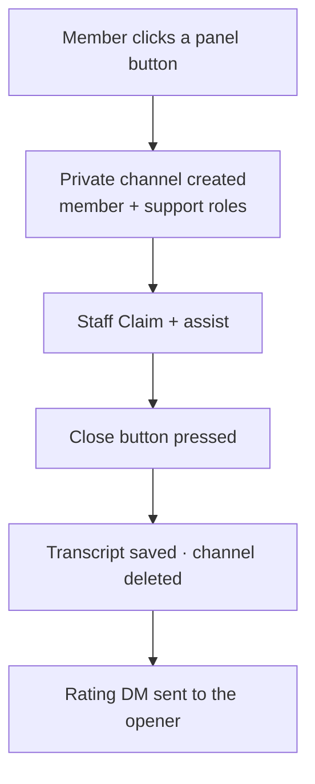

# Tickets

Members open private support tickets; on close, the bot saves a transcript and deletes the channel.
Configure everything under **Server → Tickets**, then **Publish ticket panels** (or run
`/ticketpanel`). One open ticket per member per type. Needs *Manage Channels*.

## The lifecycle

## What you configure

| Setting | What it controls |
| --- | --- |
| **Panels** (one per channel) | Each has a **name**, **channel**, default **category**, **title** and **text**. |
| **Buttons** | Each is assigned to a panel by name, and has a **label**, its own **category** (blank = the panel's), **support roles**, an **opening message**, and an **emoji**. |
| **Support roles** | Global roles pinged and given access on **every** ticket (on top of per-button roles). |
| **Default opening message** | Used when a button has none (`{user}` = the opener). |
| **Close message** | Posted in the ticket on close (`{user}` = whoever closed it). |
| **Transcript channel** | Where closed-ticket transcripts are saved. Blank falls back to your **Logs** channel; blank + no Logs = no transcript saved. |

## Claim & ratings

Staff press **Claim** so everyone knows a ticket is handled. On close, the opener is DM'd a 1–5 star
rating prompt, and scores feed the `,csat` staff leaderboard.

## Transcripts

On close the bot generates a full, formatted transcript — messages, embeds (with their accent colour)
and attachments preserved — and posts a link. Transcripts are rendered by a dedicated site
(`zee-hood-transcript`) and open only through their unguessable link, shared with the people
involved; there's nothing public to browse.
