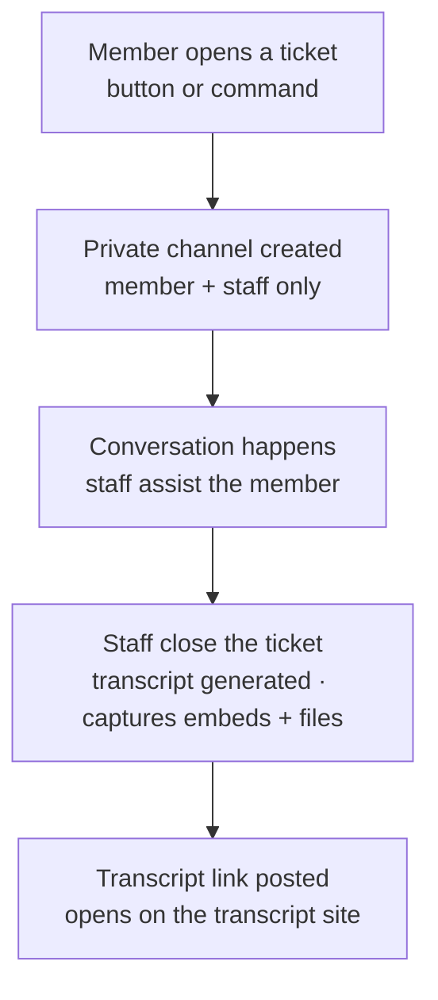

# Tickets

Tickets give members a private channel to reach staff. When a ticket closes, the whole conversation
is saved as a self-contained transcript with its own link — messages, embeds and attachments,
exactly as they happened.

## The lifecycle

A member opens a ticket, the bot spins up a private channel only they and staff can see, the
conversation happens, and on close the bot generates a transcript and posts the link. The channel
is then cleaned up — but the record lives on at the transcript link.

## The transcript

Transcripts are rendered by a dedicated site (`zee-hood-transcript`). Each one is a full, formatted
copy of the ticket — it opens only through its generated link, so there's nothing public to browse.
Embeds keep their accent color and attachments are preserved inline.

## What you can configure

| Setting | What it controls |
| --- | --- |
| **Panels** | One or more — each posts to its own channel with its own title, text and default category. |
| **Buttons** | Add as many ticket types as you want and assign each to a panel. Every button opens tickets in its own category (or the panel's), with its own emoji, opening message and support roles. |
| **Staff access** | Global support roles plus per-button roles — added to the channel and pinged when a ticket opens. |
| **Claim** | Staff press Claim so everyone knows a ticket is being handled. |
| **Ratings** | On close, the opener is DM'd a 1–5 star prompt; scores feed the `,csat` staff leaderboard. |
| **Messages** | Custom opening + close messages (`{user}` = the opener/closer). |
| **Transcripts** | Generated automatically on close and linked in your chosen transcript (or Logs) channel. |

!!! info

    Configure everything under **Server Management → Tickets**, then hit **Publish ticket panels**
    (or run `,ticketpanel`) to post them. Members can open one ticket per type at a time.

!!! info

    Tickets appear at the bottom of the [Server](server-management.md) sidebar. Transcript links are
    unguessable and only shared with the people involved.
